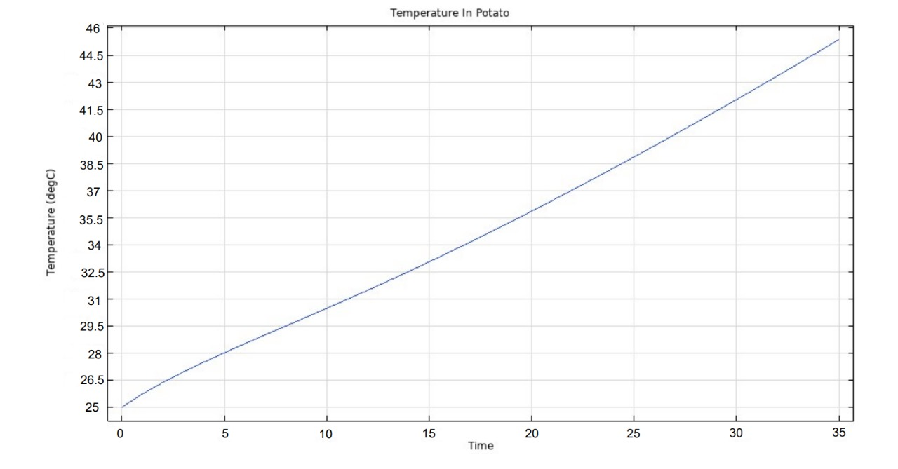

# Numerical-Investigation-of-Time-Temperature-Profile-in-Microwave-Heating-Process

## Introduction
The microwave was first built in the early 1940s. Microwave heating provides better
efficiency and, better heating rate and uses volumetric heating which means it is
converted into heat within the load. C.J. Budd conducted an experiment to calculate
temperature distribution and moisture loss using Lambert’s Law and found that end and
corner effects were a significant source of error in the model. The prediction of
temperature distribution and electric field distribution was studied by P K Loharkar and A
Ingle. This paper also explored the use of microwave heating in surface engineering. Xin
Gao used the `FEM Analysis on COMSOL Multiphysics` to solve a numerical model to
compute numerical work of coupled electromagnetic and heat transfer equations.
The research work of Krishnamoorthy Pitchai focused on temperature relation of food
particle with the power input of the microwave. It also advocated for the development of
feedback control modules for modeling tools to re-work the simulation results for
multiple constraints of variables. We have made efforts to develop a running code of `C++`
to solve the differential equation using `fourth order Runge- Kutta Method` and also to run
a simulation of the same on `COMSOLE Multiphysics Software`.

  

## Numerical Analysis
In this research study, we employed the `Runge-Kutta Method` of 4th order as our numerical approach for solving a set of nonlinear coupled ordinary differential equations that define the system under investigation. These equations were transformed into initial value problems to enable their numerical solution using the chosen method. We also took into account the corresponding boundary conditions that apply to the system.
***The graph obtained after analysing the data:-***

***We have also simulated the microwave heating model using `COMSOLE`,the obtained result are closer to the result that we obtained by applying `Runge kutta of Fourth order`:-***

***The graph obtained by the simulation model is:-***

## Conclusion
Our simulation process relied on a few simplifying assumptions to make the calculations manageable. To avoid the complexities of real potatoes, we employed a hypothetical substance with similar density and heat capacity. This simplified "potato" took the form of a rectangular block, allowing for easier modeling of its interactions with the microwave. We focused on the z-direction for the electric field's variation based on changes in the y-coordinate, effectively ignoring the magnetic field due to its negligible impact compared to its stronger counterpart. Additionally, our simulations didn't incorporate any turntable rotation, keeping the "potato" stationary throughout. Finally, we applied boundary conditions to the electric field, setting it to zero at the metal walls of the simulated microwave oven. By employing these simplifications, we were able to efficiently study the key aspects of microwave heating without getting bogged down in unnecessary details.

# References
+ Lecture notes of CLL-113(Course on Numerical Analysis by Prof.Jayati Sarkar)
+ [Fourth Order Runge-Kutta](https://lpsa.swarthmore.edu/NumInt/NumIntFourth.html)
+ [Electromagnetic and Heat Transfer Modeling of Microwave Electromagnetic and Heat
Transfer Modeling of Microwave Heating in Domestic Ovens Heating in Domestic Ovens
Krishnamoorthy Pitchai University of Nebraska at Lincoln](pkrishnamoorthy@huskers.unl.edu)
+ [Pitchai, K. (n.d.). A Finite Element Method Based Microwave Heat Transfer Modeling of
Frozen Multi-Component Foods](http://digitalcommons.unl.edu/foodscidisshttp://digitalcommons.unl.edu/foodscidiss/56)
+ Chapra, Steven C. Numerical methods for engineers / Steven C. Chapra, Berger chair in
computing and engineering, Tufts University, Raymond P. Canale, professor emeritus of civil
engineering, University of Michigan. — Seventh edition.

